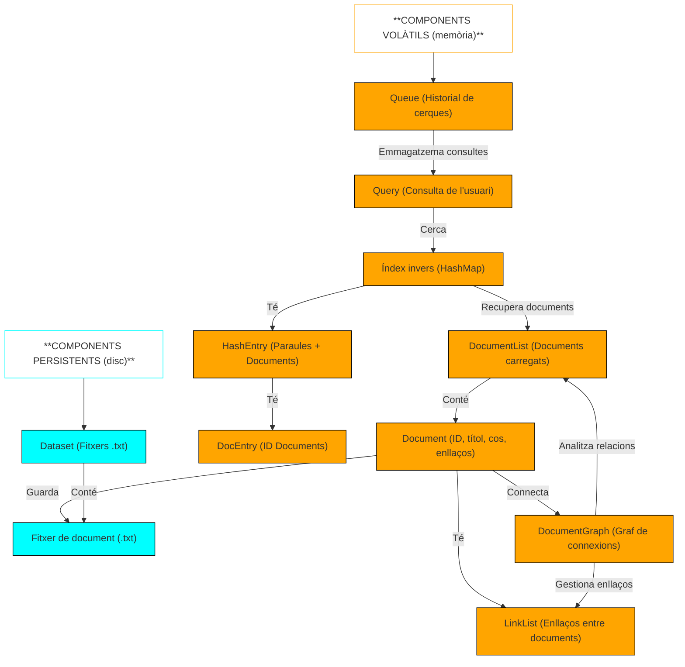

# Report: Building a search engine like Google

## 1. Diagrama de components C4

## 2. Taula d'anàlisi de complexitat

|  | Descripció | Big-O | Justificació |
|--|------------|-------|--------------|
| **Anàlisi sintàctica d'un document** | Llegeix un fitxer i extreu informació com l'ID, el títol, el cos i els enllaços | O(n), on n és la mida del document | Itera sobre el contingut del document, des de principi a final, assegurant que cada element es deserialitza correctament |
| **Anàlisi sintàctica d'una consulta** | Divideix la consulta de l'usuari en paraules i les desa en una llista enllaçada | O(q), on q és el nombre de paraules en la consulta | La consulta es divideix en tokens mitjançant strtok, operant linealment sobre la string |
| **Recompte dels veïns al gràfic** | Itera sobre tots els nodes i enllaços del gràfic | O(V+E), on V són els documents i E els enllaços entre documents | Recorre tots els nodes del gràfic i processa cada connexió |
| **Recompte de veïns d'un document** | Busca quants documents enllacen cap a un document | O(d), on d és el nombre d'enllaços en un document específic | Itera sobre la llista d'enllaços del document |
| **Cerca de documents amb una paraula clau** | Utilitza l'índex invers per accedir directament als documents amb la paraula clau | O(1) | L'accés directe al mapa hash (lookup) és constant, permetent recuperar documents de manera immediata |
| **Cerca de documents que contenen totes les paraules de la consulta** | Per cada paraula de la consulta, es recuperen els documents de l'índex invers i es fa intersecció | O(k*d), on k és el nombre de paraules de la consulta i d la mitjana de documents per paraula | Per cada paraula, accedim a l'índex i fem la intersecció entre els conjunts |
| **Classificació dels documents per rellevància** | Ordenació dels documents trobats segons el score de rellevància | O(n log n), on n és el nombre de documents recuperats | S'utilitza Quicksort per ordenar segons puntuació de rellevància |

## 3. Temps de cerca amb/sense índex invers

**Discussió:** Amb l'índex invers, el temps de cerca és constant (O(1)) perquè la cerca de documents es fa mitjançant un accés directe a l'estructura hash en lloc de recórrer tota la llista de documents. Sense índex invers, el temps de cerca augmenta proporcionalment a la mida del dataset (O(n)), ja que cada document ha de ser processat per determinar si conté les paraules de la consulta.

## 4. Temps d'inicialització del mapa hash

**Discussió:** Amb més ranures (buckets), el temps d'inicialització augmenta perquè el sistema ha de reservar més espai en memòria i configurar una estructura de dispersió més gran. Malgrat l'increment del temps d'inicialització, un mapa hash amb més ranures tendeix a millorar el rendiment en cerques posteriors, reduint la probabilitat de col·lisions i accelerant l'accés a les paraules clau.

## 5. Temps de cerca segons la mida del mapa hash

## 6. Millora de l'índex invers

+ <ins> Millora proposta</ins>:

Implementar un Trie o estructures híbrides (HashMap + Trie) per accelerar la cerca de prefixos, optimitzar la inicialització i permet trobar variants de paraules (cats, category).

+ <ins> Impacte en memòria</ins>:

Pot requerir lleugerament més memòria, però millora la velocitat de cerca dràsticament.

+ <ins> Complexitat</ins>:

Cerca en O(1) (accés directe via hash) o O(log n) en tries.

+ <ins> Temps d'execució</ins>:

L'optimització faria que la inicialització fos més ràpida que una implementació basada només en hashmaps, ja que l’índex es podria construir directament des de fitxers preprocessats.