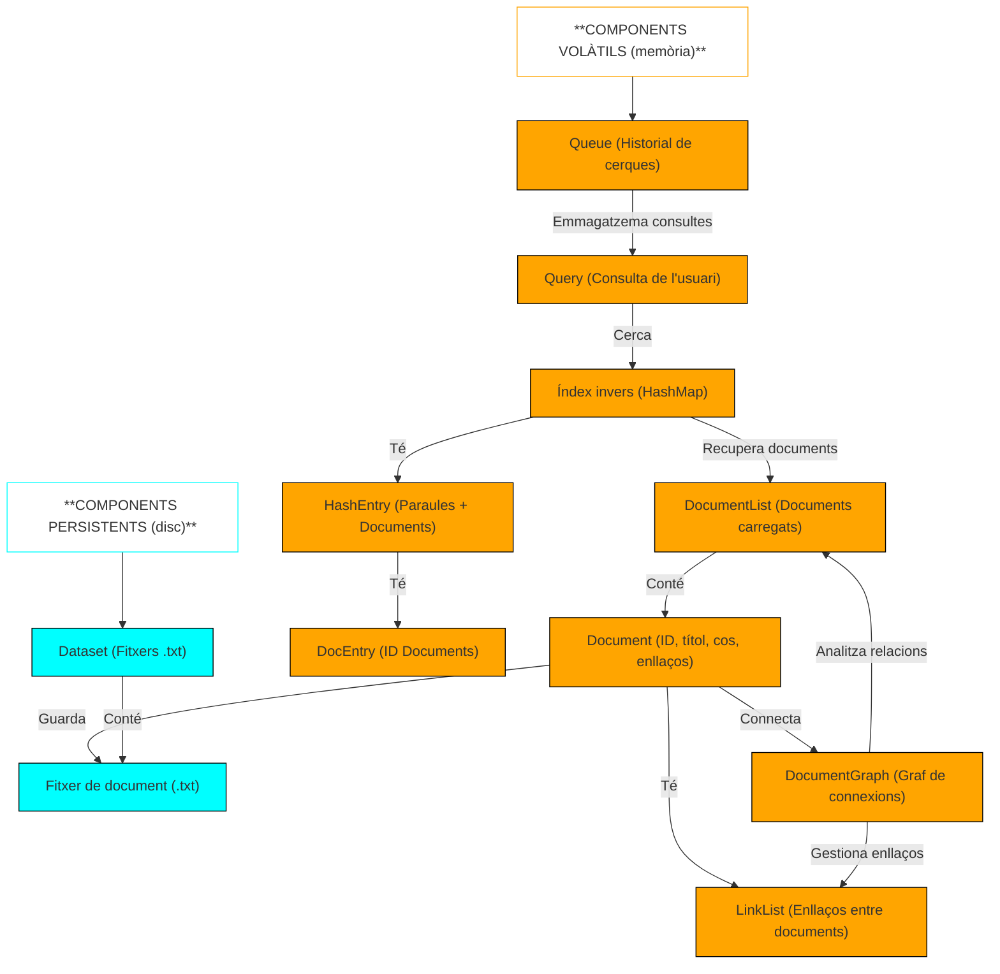

# Report: Building a search engine like Google

## 1. Diagrama de components C4

```mermaid
graph TD
    %% Components persistents (disc)
    ComponentsPersistents["**COMPONENTS PERSISTENTS (disc)**"]
    Dataset["Dataset (Fitxers .txt)"]
    File["Fitxer de document (.txt)"]
    
    %% Components volàtils (memòria)
    ComponentsVolatils["**COMPONENTS VOLÀTILS (memòria)**"]
    Query["Query (Consulta de l'usuari)"]
    Queue["Queue (Historial de cerques)"]
    Index["Índex invers (HashMap)"]
    HashEntry["HashEntry (Paraules + Documents)"]
    DocEntry["DocEntry (ID Documents)"]
    DocumentList["DocumentList (Documents carregats)"]
    Document["Document (ID, títol, cos, enllaços)"]
    LinkList["LinkList (Enllaços entre documents)"]
    Graph["DocumentGraph (Graf de connexions)"]
    
    %% Relacions entre components
    ComponentsPersistents --> Dataset
    ComponentsVolatils --> Queue
    Query -- Cerca --> Index
    Index -- Recupera documents --> DocumentList
    DocumentList -- Conté --> Document
    Document -- Té --> LinkList
    Document -- Guarda --> File
    Dataset -- Conté --> File
    Queue -- Emmagatzema consultes --> Query
    Index -- Té --> HashEntry
    HashEntry -- Té --> DocEntry
    Document -- Connecta --> Graph
    Graph -- Analitza relacions --> DocumentList
    Graph -- Gestiona enllaços --> LinkList
    
    %% Definició de colors
    classDef persistent fill:cyan,stroke:black;
    classDef volatile fill:orange,stroke:black;
    classDef compPers fill:white,stroke:cyan;
    classDef compVol fill:white,stroke:orange;
    
    %% Aplicació de colors
    class Dataset,File persistent;
    class Query,Queue,Index,HashEntry,DocEntry,DocumentList,Document,LinkList,Graph volatile;
    class ComponentsPersistents compPers;
    class ComponentsVolatils compVol;
```